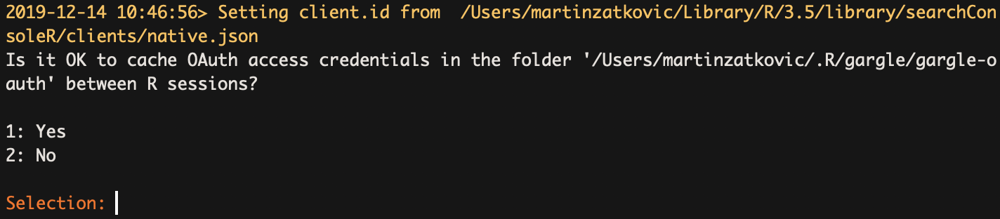

# Google Search Console API

If you need to download more data from GSC, you need to use API. The easiest way is using **Google Sheets Extension**, but when you have a large website, or you want to do some analysis, you need to use **R** or **Python programming languages**. In this repository, you could find basics (this file) and extended samples in folders.

## GSC API in R

The first step is the installation of the packages which you need to use. First, provide your authentication to your Google account, and the second one is about functions that work with GSC API.

```R
install.packages("googleAuthR")
install.packages("searchConsoleR")
```

When you have all the packages installed, you could load packages to your instance. 

```R
library(googleAuthR)
library(searchConsoleR)
```

After loading packages, you could authenticate to GSC API. After running this line, you could see a pop-up in the browser when you must log in to your Google account. 

```R
scr_auth()
```

When you use scr_auth() for the first you could see something like this:



This function provides faster scr_auth() between sessions because you could log in to your account from the cache. It's a useful feature, but if you use more Google Accounts to access GSC is not for you. Because you want to log in to different accounts, so you want every time open browser and chose Google Account.

Because you need full access to setup login, on my Seznam's pc, I have just one account, so I chose 1 (yes = could save). 

For working with GSC API, I've recommended using parameters, so you must set them. For the first, you must set up the start and end date. Don't forget that you haven't data in GSC for the last three days. These packages return an error when you don't use them after setting dates. You must set up your domain (e.g., property), which is in the GSC console. 

```R
sc_params_from <- "2019-01-01"
sc_params_to <- "2019-11-31"
sc_params_property <- "domena.cz"
sc_row_limit <- 100000
```

### Query types:

#### Date:
```R
## Pages download:
sc_dates <- search_analytics(sc_params_property, 
  sc_params_from, 
  sc_params_to, 
  dimensions = c("date"), 
  searchType = "web", 
  rowLimit = sc_row_limit)
```

This query provides you information about **date** and **clicks, impressions, CTR, and average position**. It's suitable for backup information about the performance of your website for times.

**Result:**

| date | clicks  | impressions  | ctr  | position  |
|:---:|:---:|:---:|:---:|:---:|
| 2019-09-01 | 3 | 457 | 0.006564551 | 46.78118 |
| 2019-09-02 | 4 | 291 | 0.013745704 | 36.51890 |
| 2019-09-03 | 6 | 684 | 0.008771930 | 44.73684 |

#### Pages:

```R
## Pages download:
sc_page <- search_analytics(sc_params_property, 
  sc_params_from, 
  sc_params_to, 
  dimensions = c("page"), 
  searchType = "web", 
  rowLimit = sc_row_limit)
```

This query provides you information about **pages** and **clicks, impressions, CTR, and average position**. It's useful information about your best pages and how they are working for you. 

**Result:**

| page | clicks  | impressions  | ctr  | position  |
|---|:---:|:---:|:---:|:---:|
| https://www.zatkovic.cz/aks-na-maximum-automatizace/ | 113 | 4940 | 0.022874494 | 35.682591 |
| https://www.zatkovic.cz/ | 85 | 4706 | 0.018062048 | 33.661283 |
| https://www.zatkovic.cz/co-je-datova-vrstva/ | 54 | 468 | 0.115384615 | 10.472222 |

#### Query:

```R
## Query download:
sc_page <- search_analytics(sc_params_property, 
  sc_params_from, 
  sc_params_to, 
  dimensions = c("query"), 
  searchType = "web", 
  rowLimit = sc_row_limit)
```

**Result:**

#### Page and Query:

```R
## Pagd + Query download:
sc_pagequery <- search_analytics(sc_params_property, 
  sc_params_from, 
  sc_params_to, 
  dimensions = c("page", "query"), 
  searchType = "web", 
  rowLimit = sc_row_limit)
```

This query could be used to identify keyword cannibalization because you want to search one keyword with pages. I've created a script about that which could download from [Keyword Cannibalization R repository](https://github.com/zatkoma/keyword-cannibalization). 

**Result:**